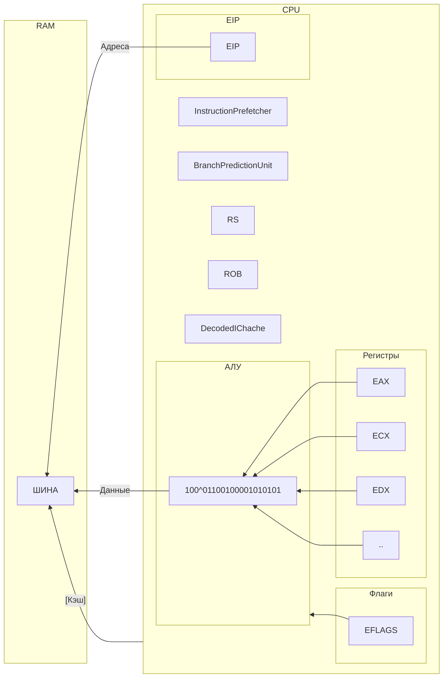

Оптиимзация - модификация программ с целью улучшения их характеристик без изменения функциональности (логики работы)

Оптимизация может выполняться не только по отношению к программе

Оптимизация:
- на уровне алгоритма (выбор более быстрого алгоритма)
- на уровне машинного кода (выбор более быстрого сочетания команд при компиляции)
- на аппаратном уровне (ускорение выполнения машинных команд)

Оптимизация может быть:
- не только по скорости выполнения
но и по другим свойствам:
- по объёму потребляемой памяти

Выполнение инструкции можно разделить на несколько этапов:
- чтение инструкций (Instruction Fetch)
- декодирование инструкции
- выполнение инструкции
- запись результатов

Количество и назначение этапов могут быть и другими

За каждый этап отвечают разные части процессора

IF -> ID -> EX -> WB

Плюсы:
- в зависимости от количества этапов и размера программы её выполнение может происходить в разы быстрее
- более эффективно используются устройства. входящие в состав процессора

Какие проблемы?
- Конфликты
	- по данным
	- по управлению
		- 
	- структурные

## Конфликты по управлению
При возникновении конфликтов:
- эффективность конвейера падает (по сравнению с максимальной), т.к.:
	- часть конвейера приходится приостанавливать
	- весь конвейер приходится перезапускать заново

Проблема:
- чтобы эффективно загрузить конвейер, нужно в каждый момент времени знать, какая инструкция будет выполнена следующей;
- если в программе есть условные переходы адрес следующей инструкции становится известен после выполнения (EX) инструкци перехода
- если в программе есть безусловный переходы, адрес следующей команды становится известен

## Структурные конфликты
## Идея!
Попробовать предсказать , будет или не будет выполнен (без-)условный переход

Например:
- Безусловные переходы выполняются
- Условные переходы назад выполняются
- Условные переходы вперёд НЕ выполняются
- Косвенные переходы НЕ выполняются

Предсказание переходов:
- статическое
- динамическое

Суть динамического предсказания:
- запоминать результаты выполнения нескольких последних инструкций перехода
- принимать решения исходя из этой информации

Вызов подпрограммы (call) - это безусловный переход

Возврат из подпрограммы (ret) - это косвенный

Для оптимизации вызовов подпрограмм используется т.н. Return Stack
Ёмкость Return Stack в большинстве современных моделей процессоров Intel составляет 16 вложенных вызовов

Процессор может выполнять инструкции не в том порядке, в котором они идут в программе
- Поступающие инструкции помещаются в RS (Reservation Station)
- Когда все операнды какой-либо инструкции готовы, она выполняется
- Результаты помещаются в ROB (ReOrder Buffer)
- Логика работы программы не изменяется

Результаты выполнения инструкции:
- записываются в операнд-приёмник
- подаются в RS, чтобы запустить зависивые от этих результатов инструкции:
	- т.е. зависимая инструкция может начать выполняться раньше, чем нужные ей данные будут записаны в источник

## Идея!
- Разместить а процессоре больше регистров, чем их существует с точки зрения программиста
- При необходимости (и по возможности) для различных инструкций одно и то же имя регистра (например EAX) связывать с различными физическими устройствами

#суперскалярные_процессоры
## Идея!
- Организовать несколько конвейеров и подавать в них инструкции параллельно

В современных процессорах Intel есть 2 конвейера на каждое ядро:
- U-pipe и V-pipe

#hyper_threading

Для каждого физического ядра процессор содержит:
- N наборов регистров
- N контроллеров прерываний
Одному физическому ядру соответствует N логических ядер
ОС видит логические ядра
- Например, 4-ядерный процессор с ht выглядит как 8-ядерный процессор

- Выполняется программы для одного из логических ядер
- Возникает задержка
	- конфликт по данным
	- кэш-промах
	- ошибка предсказания перехода
- Вместо простого ожидания ядро переключается на выполнение программы для другого логического ядра

## Идея!
- Считывать инструкции не по одной, а сразу небольшими блоками (по 16 или 32 байта)

#decoded_ichache
- Появился в процессорах линейки Sandy Bridge
	- Идея: сохранять результаты декодирования инструкций, которые уже выполнялись
	- Позволяет оптимизировать выполнение циклов состоящих не более чем из 500 инструкций
		- В некоторых случаях - 1000

#Кэширование

Идея:
- Сохранять результаты вычислений на случай, если они понадобятся снова
В современных процессорах:
- кэш данных
- кэш инструкций
- и др.

Кэш состоит из кэш-линии
- Каждая кэш-линия позволяет хранить значения некоторого колическтва смежных байтов
- ОЗУ условно делится на области такого же размера

При обращении к любому байту какой-либо области ей может быть поставлена в соответствие кэш-линия
- содержимое области копируется в кэш
при обращении к памяти возможны две ситуации:
- данные уже есть в кэше - cache list
- Данных ещё нет в кэше - cache miss

- В случае попадания данные берутся из кэша
- В случае промаха происходит обращение к более медленной ОЗУ

Кш может быть реализован:
- внутри ядра процессора
- общий кэш для всех ядер процессора
- общий для всех процессоров
- и т.д.

Архитектура IA-32 гарантирует [когерентность](https://ru.wikipedia.org/wiki/Когерентность) кэшей всех ядер

Дополнительно [RISC- и CISC-архитектуры](<RISC- и CISC-архитектуры.md>)
