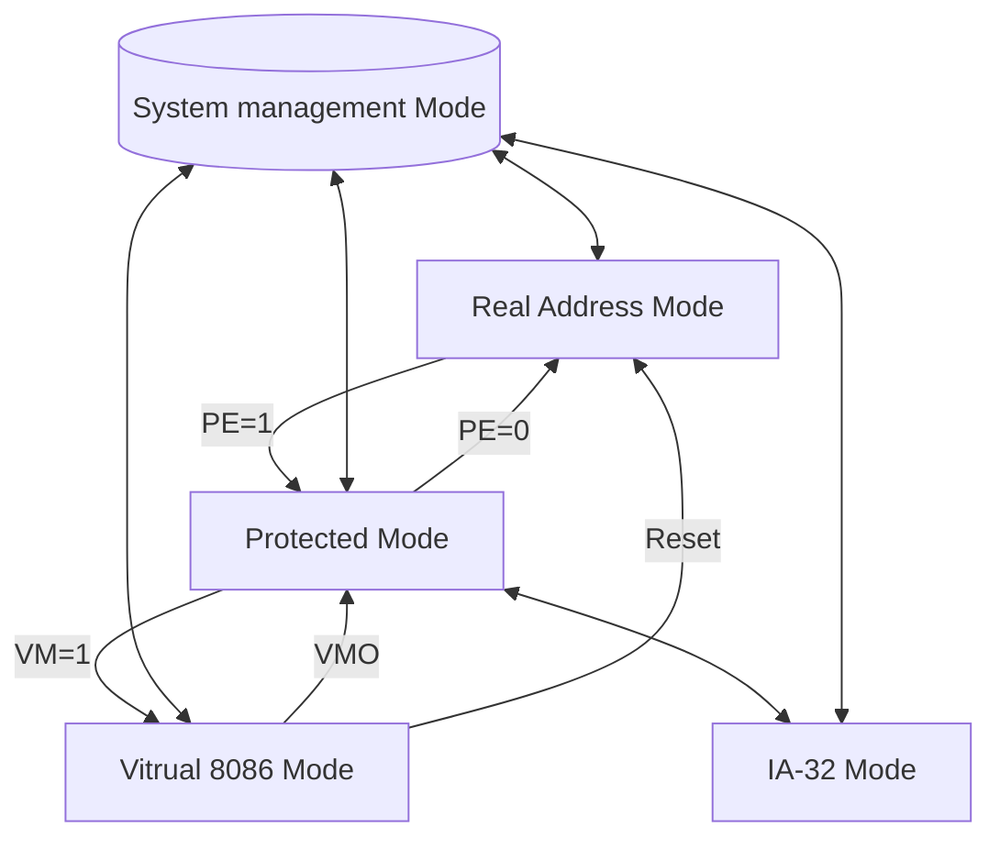

**Ассемблер** – программа, преобразующая исходный текст программы на язке ассемблер в программу на машинном коде.

**Язык ассемблер** – язык низкого уровня с инструкциями, обычно соответствующими командам машины:
- максимально полный контроль поведения программы
- максимально эффективное использование возможностей программы
- приучает к разбиению программы на небольшие составные части

==Широко используется в демосцене==

**Демосцена** – субкультура и направление компьютерного искусства, состаляющей одной из своих целей демонстрацию максимума возможностей платформ.

==Ассеблеры существуют для разных платформ==
- В курсе "Конструирование ПО" рассматривается ассемблер для платформы Intel 64 / Intel IA-32
- В центре внимания - реальный режим (real-address mode)

- Virtual 8086 Mode - для
- Protected Mode - добавление

Используется FASM
**Преимущества:**
- простой и продуманный синтаксис
- существует для всех основных платформ
- мощная система макрасов
- и т.д.

>[!INFO] Про Assembler (FASM)
>**Отладчик**: Turbo Debugger
>**Справочник**: MS-DOS:TechHelp
>**По инструкциям**: документация Intel
>**Операционная система**: Windows XP 32bit
>**HEX-редактор**: WinHEX

**Процессор выполняет бесконечный цикл:**
- прочитать очередную инструкцию (fetch)
- декодировать инструкцию (decode)
- загрузить исходные данные (read)
- выполнить инструкцию (execute)
- записать результаты (write-back)
- повторить для следующей инструкции

==Команды процессора принято называть **_инструкциями_**==

**Инструкция задаёт:**
- операцию (что делать?)
- операнды (с чем это делать?)

**В машинном коде – инструкция – один или несколько байтов**
- Assembly позволяет записывать инструкции "словами"

>[!warning] ВАЖНО
>**Байты** состоят из **битов**, бит принимает два состояния: **0 и 1**
>Не бывает **"пустых"** или же **"чистых"** битов и байтов
> - Если там нули - 0
> - Если неизвестно - не определено
> - Само по себе значение бита/байта или набора байтов бессмысленно
> 
> Например 13^(16) может быть:
> - беззнаковой - 195
> - знаковой - -61
> - "Г" - Win1251
> - инструкция `RET`

При подаче питания на процессор начинает выполнять инструкции

**Немного об инструкциях:**
- Инструкции хранятся в ОЗУ
- Первую инструкцию считывает по адресу `FFFF:FFF0`
- Каждую следующую - там, где закончилась предыдущая
- Некоторые позволяют изменить порядок выполнения