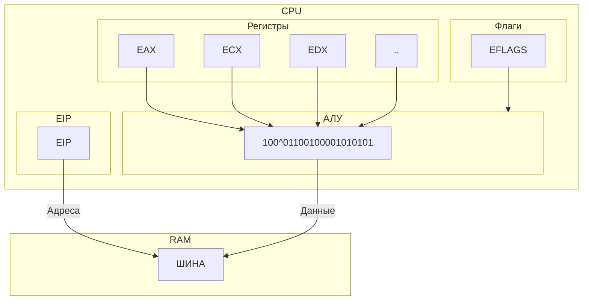

**При запуске программы ОС:**
- Считывает исполняемый файл в ОЗУ
- Определяет его формат
- Определяет, откуда Должно начаться выполнение программы
	- Это место называется "точка ввода" (entry point)
- Передаёт туда управление: т.е. помещает в (E)IP адрес этого места

>[!warning] Понятие **код** и **данные** условны!
>**Код** – то, что выполняет процессор (выполняет то, что в адресе (E)IP )
>
>**Данные** – то, с чем работают инструкции (адрес внутри инструкций)
>
>Для процессора программа - просто массив байтов

**Ассемблер (компилятор):**
- генерирует массив байтов, последовательно просматривая текст программы;
- полученный массив записывает "как есть" в выходной файл
**Добавлять новые байты могут:**
- инструкции
- некоторые директивы ассемблера
**Программирование сводится к двум основным действиям:**
- подготовка данных
- вызов стандартных/системных функций
**В разных ОС правила вызова системных функций различны**
**Для вызова системной функции необходимо:**
- подготовить исходные данные (параметры)
- вызвать функцию
Для каждой функции могут быть свои правила передачи параметров и вызова функции `mov`:
	выав значение операнда-источника в операнд-приёмник
	Не изменяет (E)FLAGS `mov dest, src`
	Оба операнда должны иметь одинаковый размер `mov ax, bh` - так нельзя
- Одна из немногих инструкций, операндами которой могут быть сегментные регистры
- Нельзя использовать регистр `CS` в качестве приёмника
	- `mov cx, ax` - нельзя / `mov ax, cs` - можно

```FASM
;программа Hello World!

	org 100h
start:
	mov ah, $09
	mov dx, strHello
	int 21h

	mov ah, $08
	int 21h

strHello db "Hello World!$"
```

В MS-DOS для вызова используется операция int 21h
Большинство параметров передаётся через регистры
Директивы определения данных позволяют использовать операцию `dup`

Если первоначальное значение участка памяти не задано, в качество значения можно указать символ (?)

```FASM
...
SomeData db 512 dup(512)
...
```

### Директива org
Директива **org** указывает ассемблеру значение с которого следует продолжать вычисление адресов. Может использоваться много раз

Для директивы org в файл не добавляются байты, но она может влиять на значение некоторых байтов - тех, в которые передаются адреса

### COM-программы
- При загрузке файла записывается в ОЗУ начиная с адреса `100h`
- Управление передаётся на адрес `100h`
- Содержание COM-файла – дамп памяти, т.е. копия того, что будет находиться в памяти после запуска программы
- Максимальный размер – 64КБ

### EXE-программы
- Имеет более сложную структуру
- Содержит указания ОС о том:
	-  как производить загрузку и запуск программы
	- сколько памяти выделить для программы
- Может иметь размер более 64КБ